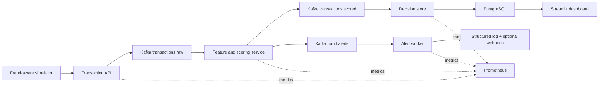

# Real-Time Fraud Detection Pipeline

[](https://github.com/RaveendraS33/real-time-fraud-detection-pipeline/actions/workflows/ci.yml)

A local-first streaming data and machine-learning project that scores payment transactions,
explains suspicious activity, and presents fraud operations metrics in near real time.

The project is designed as a job-search portfolio system: reproducible infrastructure,
versioned data contracts, testable detection logic, operational visibility, and clear cost
controls matter as much as producing a prediction.

## Highlights

- **End-to-end streaming pipeline:** FastAPI ingestion -> Kafka -> a feature/scoring detector ->
  decision store -> Streamlit operations dashboard, all reproducible via Docker Compose.
- **Hybrid detection:** explainable deterministic rules combined with a versioned logistic-regression
  model, offline-trained and shipped as a compact JSON artifact for dependency-free online scoring.
- **Production-minded reliability:** manual-commit Kafka consumers, a dead-letter topic for poison
  messages, a dedicated alert worker on the `fraud.alerts` topic, and graceful shutdown.
- **Observability:** Prometheus scrapes every service, and each worker's metrics endpoint doubles as
  its Docker health check.
- **Tested and CI-gated:** unit tests plus a live Docker integration test
  (API -> Kafka -> detector -> PostgreSQL, with alert verification); CI runs ruff, pytest,
  model-artifact verification, and the integration job.
- **$0 and local-first:** the entire system runs on free, open-source software with no cloud spend.

## Architecture



See [the architecture notes](docs/ARCHITECTURE.md) for design decisions.

## Dashboard

The Streamlit operations dashboard reads live decisions from PostgreSQL: fraud-operations metrics,
the approve/decline mix, transaction volume over time, and an investigation queue of recent alerts.


## Planned Detection Signals

- Unusually high transaction amount
- Rapid transaction velocity within event-time windows
- New device or country for a customer
- Geographic travel inconsistent with elapsed time
- Merchant and transaction risk features
- Machine-learning probability combined with explainable rules

## Current Phase

Phase 6 adds a fraud-alert worker that consumes the `fraud.alerts` topic and dispatches each
non-approve decision to a structured log and an optional webhook, closing the detection-to-action
loop. It reuses the same metrics, health-check, and dead-letter patterns as the other workers.

## Local Setup

Requirements: Docker Desktop, Git, and Python 3.11 or newer.

```powershell
Copy-Item .env.example .env
python -m venv .venv
.\.venv\Scripts\Activate.ps1
python -m pip install --upgrade pip
pip install -r requirements-dev.txt
docker compose up -d
```

Open the API documentation at <http://localhost:8000/docs>, or inspect a valid event at
<http://localhost:8000/transactions/sample>.

Open the fraud operations dashboard at <http://localhost:8501>.

Generate a small mixed stream:

```powershell
.\.venv\Scripts\python.exe scripts\simulate_transactions.py --count 25 --fraud-rate 0.12
```

Reproduce the model artifact:

```powershell
.\.venv\Scripts\python.exe scripts\train_model.py --samples 20000 --fraud-rate 0.08 --seed 42
```

See the [model card](docs/MODEL_CARD.md) for feature definitions, holdout metrics, and limitations.
Operational checks and recovery commands are documented in the [runbook](docs/RUNBOOK.md).

Check the infrastructure:

```powershell
docker compose ps
docker compose config --quiet
ruff check .
ruff format --check .
pytest
```

Stop the local stack:

```powershell
docker compose down
```

Use `docker compose down -v` only when you intentionally want to delete local Kafka and
PostgreSQL data.

## Cost

The core pipeline uses free, open-source software and runs locally for `$0`. AWS is not required.
Any future cloud extension is governed by the project [cost policy](docs/COST_POLICY.md), with a
hard maximum of `$5` total AWS spend.

## Roadmap

- [x] Repository foundation, local infrastructure, cost policy, and CI
- [x] Typed transaction API and fraud-aware simulator
- [x] Event-time streaming features and explainable rules
- [x] Offline model training and versioned online scoring
- [x] PostgreSQL decision store and Streamlit dashboard
- [x] End-to-end tests, operational metrics, and runbook
- [x] Fraud-alert worker: structured-log and optional-webhook alerting on `fraud.alerts`
