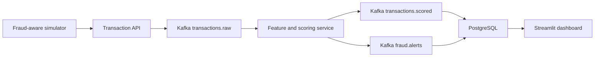

# Real-Time Fraud Detection Pipeline

A local-first streaming data and machine-learning project that scores payment transactions,
explains suspicious activity, and presents fraud operations metrics in near real time.

The project is designed as a job-search portfolio system: reproducible infrastructure,
versioned data contracts, testable detection logic, operational visibility, and clear cost
controls matter as much as producing a prediction.

## Architecture



See [the architecture notes](docs/ARCHITECTURE.md) for design decisions.

## Planned Detection Signals

- Unusually high transaction amount
- Rapid transaction velocity within event-time windows
- New device or country for a customer
- Geographic travel inconsistent with elapsed time
- Merchant and transaction risk features
- Machine-learning probability combined with explainable rules

## Current Phase

Phase 0 establishes the local Kafka and PostgreSQL foundation, project configuration, cost
policy, and continuous integration. Application services are added incrementally so each phase
can be understood and verified independently.

## Local Setup

Requirements: Docker Desktop, Git, and Python 3.11 or newer.

```powershell
Copy-Item .env.example .env
python -m venv .venv
.\.venv\Scripts\Activate.ps1
python -m pip install --upgrade pip
pip install -r requirements-dev.txt
docker compose up -d
```

Check the infrastructure:

```powershell
docker compose ps
docker compose config --quiet
ruff check .
pytest
```

Stop the local stack:

```powershell
docker compose down
```

Use `docker compose down -v` only when you intentionally want to delete local Kafka and
PostgreSQL data.

## Cost

The core pipeline uses free, open-source software and runs locally for `$0`. AWS is not required.
Any future cloud extension is governed by the project [cost policy](docs/COST_POLICY.md), with a
hard maximum of `$5` total AWS spend.

## Roadmap

- [x] Repository foundation, local infrastructure, cost policy, and CI
- [ ] Typed transaction API and fraud-aware simulator
- [ ] Event-time streaming features and explainable rules
- [ ] Offline model training and versioned online scoring
- [ ] PostgreSQL decision store and Streamlit dashboard
- [ ] End-to-end tests, operational metrics, and runbook

