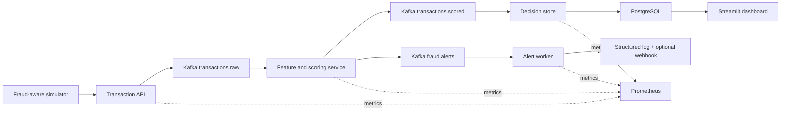
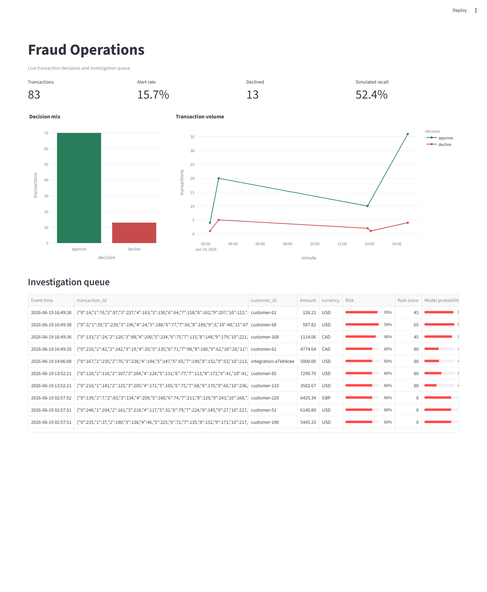

# Real-Time Fraud Detection Pipeline

[](https://github.com/RaveendraS33/real-time-fraud-detection-pipeline/actions/workflows/ci.yml)

A local-first streaming data and machine-learning project that scores payment transactions,
explains suspicious activity, and presents fraud operations metrics in near real time.

The project is designed as a job-search portfolio system: reproducible infrastructure,
versioned data contracts, testable detection logic, operational visibility, and clear cost
controls matter as much as producing a prediction.

## Highlights

- **End-to-end streaming pipeline:** FastAPI ingestion -> Kafka -> a feature/scoring detector ->
  decision store -> Streamlit operations dashboard, all reproducible via Docker Compose.
- **Hybrid detection:** explainable deterministic rules combined with a versioned logistic-regression
  model, offline-trained and shipped as a compact JSON artifact for dependency-free online scoring.
- **Production-minded reliability:** manual-commit Kafka consumers, a dead-letter topic with replay
  tooling, an alert worker with retry/backoff and dead-letter capture, Prometheus alert rules routed
  to Alertmanager, and graceful shutdown.
- **Observability:** Prometheus scrapes every service (each worker's metrics endpoint doubles as its
  Docker health check), a lag-exporter publishes Kafka consumer-group lag, and alert rules route to
  Alertmanager.
- **Tested and CI-gated:** unit tests plus a live Docker integration test
  (API -> Kafka -> detector -> PostgreSQL, with alert verification); CI runs ruff, pytest,
  model-artifact verification, and the integration job.
- **$0 and local-first:** the entire system runs on free, open-source software with no cloud spend.

## Goals and Success Criteria

The system targets card-not-present transaction fraud and is tuned as a **high-recall alerting**
tool: catch as much fraud as possible for human review while keeping the false-positive rate
visible and tunable through the score thresholds.

Measured on the synthetic holdout and the local stack (reproduce with the scripts below):

| Dimension | Measured |
| --- | --- |
| Model ranking quality | ROC AUC **0.99**, average precision **0.89** |
| Recall at the 0.5 threshold | **0.85** (threshold-tunable; the hybrid rules add coverage) |
| Precision at the 0.5 threshold | **0.79** |
| Probability calibration | Platt-scaled, Brier **0.022** (top bin 0.42 predicted vs 0.43 observed) |
| Ingestion throughput | ~**300 transactions/s** accepted |
| API latency | p50 **~50 ms**, p99 **~59 ms** |
| Detector scoring latency | **~2.4 ms** avg, **~4.8 ms** p95 (Prometheus) |
| End-to-end throughput (API -> Kafka -> detector -> PostgreSQL) | ~**98 transactions/s** |

These are demonstration numbers on synthetic data and a single-node Docker stack, not production
guarantees. Reproduce the model numbers with `scripts/evaluate_model.py` and the latency/throughput
numbers with `scripts/benchmark.py`.

## Architecture



See [the architecture notes](docs/ARCHITECTURE.md) for design decisions.

## Dashboard

The Streamlit operations dashboard reads live decisions from PostgreSQL: fraud-operations metrics,
the approve/decline mix, transaction volume over time, and an investigation queue of recent alerts.



## Detection Signals

**Implemented** (deterministic rules in `src/fraud_detection/rules.py`, combined with the model
probability in `src/fraud_detection/scoring.py`):

- High transaction amount (`high_amount`, +60)
- High transaction velocity in the 5-minute event-time window (`high_velocity`, +35)
- New device for the customer (`new_device`, +20)
- New country for the customer (`new_country`, +25)
- Risky merchant on a non-trivial amount (`risky_merchant_amount`, +20)
- A logistic-regression fraud probability over the five engineered features (model `logreg-v1`)

The final risk score is `max(rule_score, round(model_probability * 100))`, mapped to
approve / review / decline by configurable thresholds (review >= 40, decline >= 70).

**Planned / future:**

- Geographic travel inconsistent with elapsed time ("impossible travel")
- Account-takeover behavioral signals
- A gradient-boosted model compared against the logistic baseline

## Worked Example

A $5,000 e-commerce purchase at a risky merchant scores like this:

| Field | Value |
| --- | --- |
| `triggered_rules` | `high_amount` (+60), `risky_merchant_amount` (+20) |
| `rule_risk_score` | 80 |
| `fraud_probability` | model output over the engineered features |
| `risk_score` | `max(80, round(probability * 100))` |
| `decision` | **decline** (>= 70) |

The decision is published to `transactions.scored` (persisted) and `fraud.alerts` (which the alert
worker turns into an operator alert). Every decision retains its triggered rules and scores, so each
alert is explainable.

## Current Phase

The pipeline is feature-complete and hardened. Recent work added measured performance and model
calibration, Prometheus alert rules for failures and pipeline stalls, and a security/privacy note;
see the Goals and Success Criteria above and the linked documentation.

## Local Setup

Requirements: Docker Desktop, Git, and Python 3.11 or newer.

```powershell
Copy-Item .env.example .env
python -m venv .venv
.\.venv\Scripts\Activate.ps1
python -m pip install --upgrade pip
pip install -r requirements-dev.txt
docker compose up -d
```

Open the API documentation at <http://localhost:8000/docs>, or inspect a valid event at
<http://localhost:8000/transactions/sample>.

Open the fraud operations dashboard at <http://localhost:8501>.

Generate a small mixed stream:

```powershell
.\.venv\Scripts\python.exe scripts\simulate_transactions.py --count 25 --fraud-rate 0.12
```

Reproduce the model artifact:

```powershell
.\.venv\Scripts\python.exe scripts\train_model.py --samples 20000 --fraud-rate 0.08 --seed 42
```

See the [model card](docs/MODEL_CARD.md) for feature definitions, holdout metrics, and limitations.
Operational checks and recovery commands are documented in the [runbook](docs/RUNBOOK.md).

Check the infrastructure:

```powershell
docker compose ps
docker compose config --quiet
ruff check .
ruff format --check .
pytest
```

Stop the local stack:

```powershell
docker compose down
```

Use `docker compose down -v` only when you intentionally want to delete local Kafka and
PostgreSQL data.

## Testing

- **Unit tests** cover schemas, rules, scoring, the model artifact, storage mapping, alert
  formatting, and config (`tests/`). Run with `pytest`.
- **Coverage:** `pytest --cov=fraud_detection` (the `pytest-cov` plugin is a dev dependency).
- **Live integration test** drives a real transaction through API -> Kafka -> detector ->
  PostgreSQL and asserts the alert reaches `fraud.alerts`
  (`tests/integration/test_live_pipeline.py`); run it against a running stack with
  `.\scripts\run_integration_tests.ps1`.
- **Measured behavior:** `scripts/evaluate_model.py` reports ROC/PR/calibration;
  `scripts/benchmark.py` reports latency and throughput against the live stack.

CI runs ruff, pytest, model-artifact verification, `docker compose config`, and the live
integration job on every push.

## Documentation

- [Architecture and design decisions](docs/ARCHITECTURE.md)
- [Model card](docs/MODEL_CARD.md) — features, metrics, calibration, limitations
- [Operations runbook](docs/RUNBOOK.md) — health checks, alerts, performance, recovery
- [Security and privacy](docs/SECURITY.md)
- [Cost policy](docs/COST_POLICY.md)

## Cost

The core pipeline uses free, open-source software and runs locally for `$0`. AWS is not required.
Any future cloud extension is governed by the project [cost policy](docs/COST_POLICY.md), with a
hard maximum of `$5` total AWS spend.

## Roadmap

- [x] Repository foundation, local infrastructure, cost policy, and CI
- [x] Typed transaction API and fraud-aware simulator
- [x] Event-time streaming features and explainable rules
- [x] Offline model training and versioned online scoring
- [x] PostgreSQL decision store and Streamlit dashboard
- [x] End-to-end tests, operational metrics, and runbook
- [x] Fraud-alert worker: structured-log and optional-webhook alerting on `fraud.alerts`
- [x] Portfolio polish: CI badge, highlights, and a live dashboard screenshot
- [x] Measured performance and calibration, Prometheus alert rules, and a security note
- [x] Fault tolerance and ops: alert retry/backoff + dead-letter capture and replay, Alertmanager
      routing, and failure-mode + schema-evolution tests
- [x] Kafka consumer-lag exporter (`fraud_consumer_lag`) and a ConsumerLag alert
- [x] Probability calibration (Platt scaling on a held-out split) to fix high-end over-confidence
