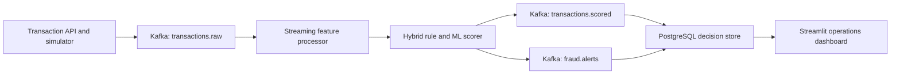

# Architecture

## Target Data Flow

## Design Principles

- **Local first:** the complete system runs under Docker Compose with no paid services.
- **Event contracts:** Pydantic schemas version transaction and decision payloads.
- **Hybrid detection:** deterministic rules provide explainable alerts while a trained model
  contributes a calibrated fraud probability.
- **Training-serving parity:** offline training and online scoring import the same feature-vector
  function; the compact JSON artifact is validated before the detector starts.
- **Event time:** velocity features use transaction timestamps rather than processing time.
- **Traceability:** every decision retains its transaction ID, model version, triggered rules,
  feature values, and processing timestamp.
- **Idempotent storage:** PostgreSQL upserts by transaction ID and accepts only an equal or newer
  processing timestamp, making Kafka replays safe.
- **Reproducibility:** pinned container images, automated tests, and CI validate each change.
